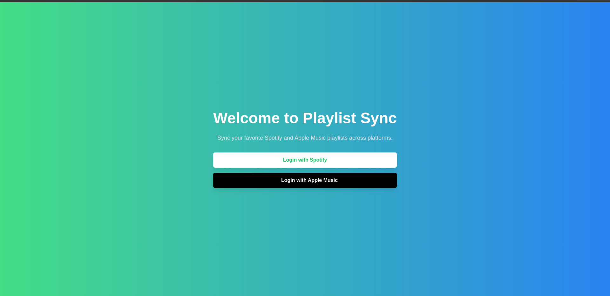
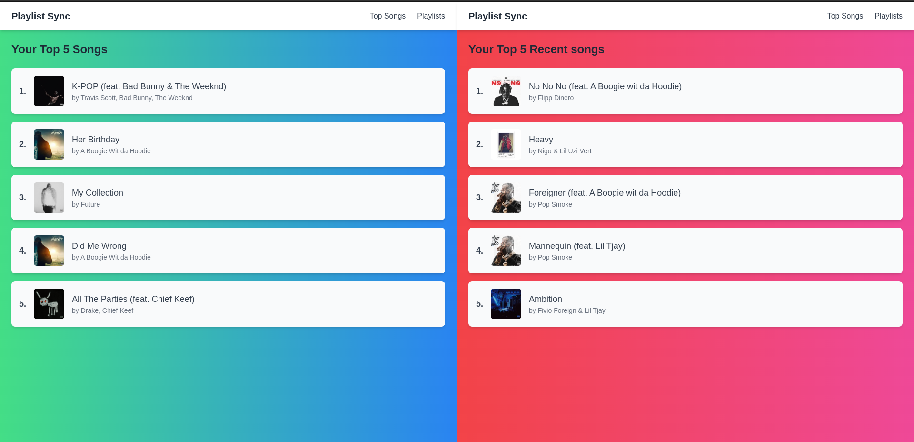
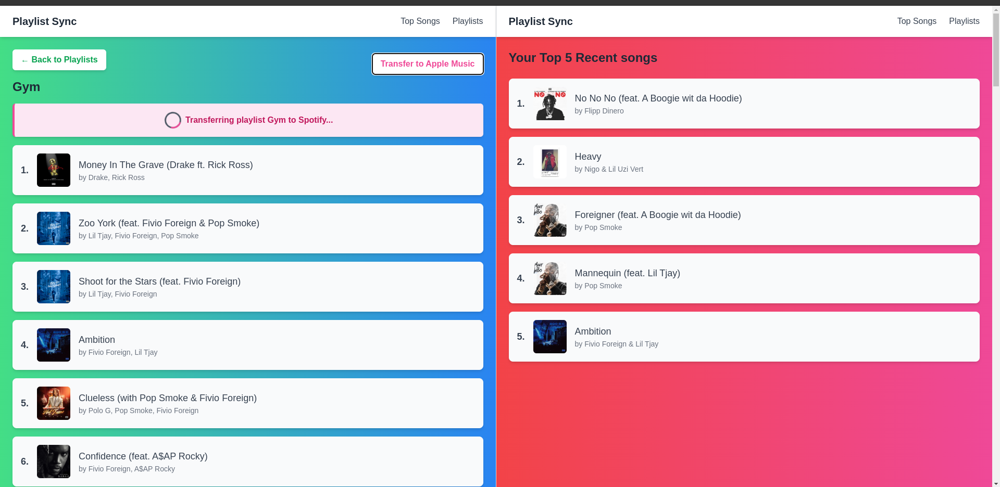
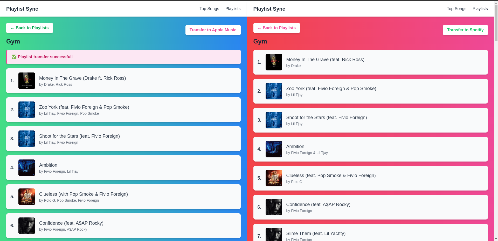

# Playlist-Sync 🎵🔄  
**Transfer your playlists between Spotify and Apple Music effortlessly**  

## 🚀 About the Project  
Playlist-Sync is a web application that allows users to transfer their playlists between Spotify and Apple Music seamlessly. It was built to solve a real problem I faced when switching music streaming platforms: the lack of an easy way to migrate my playlists.  

## 🛠️ Tech Stack  
- **Frontend:** React.js, Tailwind CSS  
- **Backend:** Spring Boot  
- **Authentication:** OAuth for Spotify, MusicKit for Apple Music  

## 🎯 Features  
✔ Authenticate with Spotify and Apple Music  
✔ View and select playlists to transfer  
✔ Convert and sync playlists between platforms  
✔ Responsive UI with Tailwind CSS  

## 🎵 How it works
1. Log into your Spotify and Apple Music account using Playlist-Sync 
2. Find the playlist you want to transfer.
3. Click the transfer button.
4. Enjoy your music!

## 📸 Screenshots

### Login Page

### Playlist-Sync Dashboard 

### Playlist Transfer

### Transfer Complete
